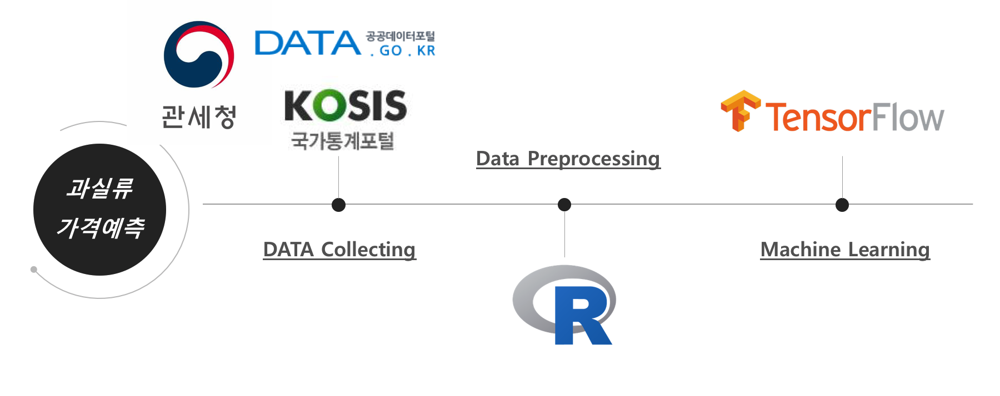
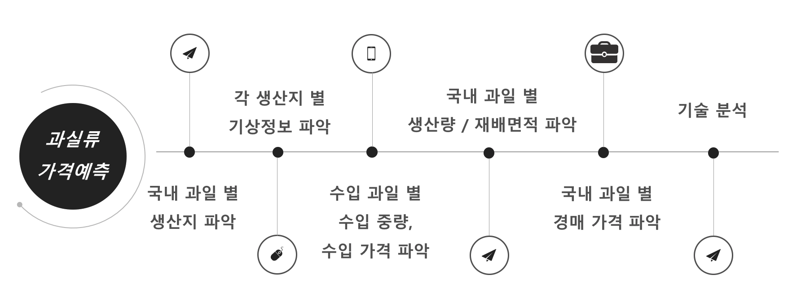
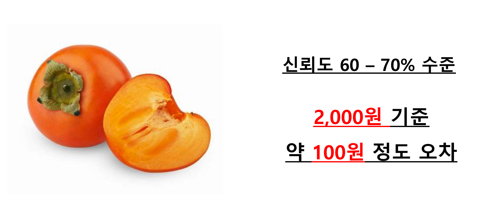

# FruitKing

## 목차
1. 프로젝트 개요

2. 프로젝트 진행내용

3. 프로젝트 결과

## 프로젝트 개요
- __프로젝트명__ : 국내과실류가격예측 프로젝트

- __기간__ : 2017년 8월 ~ 2017년 11월

- __설명__

  2015년 기준 국내 과실 시장 규모 약 1.5조원 규모로 매년 국내 과실 시장 규모는 크게 증가하고 있다. 국내 과실 시장에서 과실류의 가격은 과실의 생산 현황, 수요 공급 예측 시스템, 수입 과일에 의해 결정 된다. 최근 국내 과실 시장에서의 수입 과일의 점유율은 2016년 기준 약 30% 육박하며 점차 수입 과일의 종류도 다변화하며 점차 점유율이 늘어나고 있다.

  하지만, 이렇게 국내 과실 시장의 규모가 커지고 다변화함에도 불구하고 농축산물에 대한 정확한 데이터 인프라가 구축되어있지 않아 주먹구구식의 관측으로 과실 수급면적을 결정하거나 대략적인 과실 재배량을 가지고 수입과일의 수입량을 결정하고 있는 실정이다.

  농축산물 관측 정보는 연구원들이 직접 현지에 나가 조사를 벌여 전년과 평년대비 분석을 통해 수급 면적과 양이 결정되며 이러한 주먹구구식의 과실 수급면적의 결정은 국내 과실 농가의 추측성 재배를 유도하여 국내 과일 농가의 생산 소득 감소로 이어지고 있다. 또한, 부정확한 수요 공급 예측 시스템으로 인해 과일을 수입하는 수입사에서도 지속적으로 문제를 야기하고 있는 실정이다.

  따라서, 본 프로젝트를 통해 국내 과일 시장 가격형성에 대한 분석인프라와 데이터의 부재를 해결하고 나아가 과실류 가격을 예측해보고자 한다.

## 프로젝트 진행내용

데이터 수집 : 관세청, KOSIS 국가통계포털, 공공데이터포털에서 제공해주는 API를 통해서 필요한 데이터를 수집
데이터 정제 : 수집한 대량의 데이터를 필요한 양식으로 수정하기 위해 R 프로그램을 사용하여 데이터 정제
데이터 학습 : Tensorflow를 통해 정제한 데이터를 학습하여 실제 예측을 실시

1. 국내 과일 별 생산지를 파악
  - 국내 과일 : 감, 감귤, 배, 복숭아, 사과, 수박, 자두, 참외, 토마토, 포도
  - 생산지 : 서울, 부산, 대구, 인천, 광주, 대전, 울산, 세종, 경기, 강원, 충청북도, 충청남도, 전라북도, 전라남도, 경상북도, 경상남도, 제주도

2. 각 생산지 별 기상정보를 파악
  - 기상정보 : 평균기온, 일강수량, 랍계 일조시간

3. 수입 과일 별 수입 중량, 수입 가격 파악
  - 수입과일 : 레몬, 망고, 바나나, 석류, 아보카도, 오렌지, 자몽, 키위, 파인애플, 포도

4. 국내 과일 별 생산량 / 재배면적 파악
  - 생산량 / 재배면적을 통해 가중치 파악

5. 국내 과일 별 경매 가격 파악
  - 경매장 : 서울청과, 동화청과, 한국청과, 중앙청과, 농협가락

6. 기술 분석
  - Tensorflow와 정제한 데이터를 통해 다변량회귀분석 실시

## 프로젝트 결과

컴퓨팅 파워 부족으로 인해 "감"만을 가지고 다변량 회귀분석을 실시!

